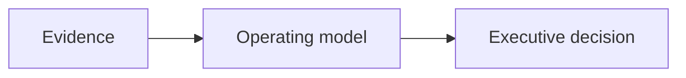

# [Knowledge Diagram title]

> **Diagram specification.** This asset defines an executive-readable visual. It is not artwork and must not be published as evidence until its sources, labels, and claim boundary are reviewed.

## Purpose

[What executive question this visual answers.]

## Executive audience

[CEO / COO / CIO / business owner / functional leader.]

## Business problem

[The operating problem the diagram makes visible.]

## Visual layout

[Describe nodes, lanes, sequence, labels, legend, and the executive takeaway.]

## Mermaid Source

## Executive decision

[The bounded decision this visual supports.]

## Executive risks and tradeoffs

- Risks: [failure modes made visible]
- Tradeoffs: [the decision tension the audience must resolve]

## Inputs

- [Source evidence, experience, workflow artifact, or approved data.]

## Outputs

- [What the viewer can understand or decide after reviewing the diagram.]

## Linked evidence

| Evidence | Why it supports the diagram | Claim boundary |
|---|---|---|
| [...] | [...] | [...] |

## What this diagram demonstrates

[Bounded implementation, workflow, governance, or operating-pattern claim.]

## What this diagram does not establish

[No causal ROI, client result, compliance certification, or generalization unless evidence supports it.]

## Consulting interpretation

### Why this matters

[Business consequence of leaving this operating constraint unresolved.]

### What executives usually miss

[Invisible decision right, handoff, dependency, or evidence gap.]

### Typical failure modes

- [Failure mode]

### Common anti-patterns

- [Anti-pattern]

### What changes when this improves

[Bounded operating change; do not imply an outcome without evidence.]

### Executive discovery questions

- [Question 1]
- [Question 2]
- [Continue to approximately ten questions.]

### Recovery opportunities

[A bounded first recovery move: evidence, owner, escalation, and review.]

### Maturity model

1. Ad hoc
2. Email approvals
3. Governed
4. Measured
5. Operational intelligence

### Cross-industry mapping

[Healthcare, insurance, banking, commercial lending, financial services, manufacturing, supply chain, government, professional services, and commercial real estate equivalents.]

### RachelOS reference (when applicable)

[State the separately bounded evidence reference; do not force RachelOS into unrelated diagrams.]

### Related sources and derivative assets

[List existing Experience/Evidence/Problem/Pattern/Framework/Authority Package references where persisted; otherwise cite source artifacts without creating a duplicate registry.]
