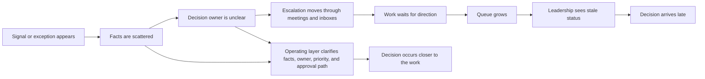

# Decision Latency Pattern

```mermaid
flowchart LR
    signal["Signal or exception appears"]
    facts["Facts are scattered"]
    owner["Decision owner is unclear"]
    escalation["Escalation moves through meetings and inboxes"]
    wait["Work waits for direction"]
    backlog["Queue grows"]
    status["Leadership sees stale status"]
    outcome["Decision arrives late"]

    operating["Operating layer clarifies facts, owner, priority, and approval path"]
    timely["Decision occurs closer to the work"]

    signal --> facts --> owner --> escalation --> wait --> backlog --> status --> outcome
    facts --> operating
    owner --> operating
    operating --> timely
```
