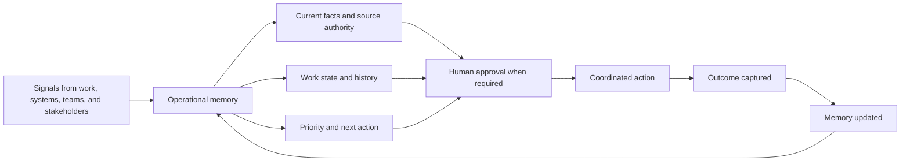

# Operational Memory Pattern

```mermaid
flowchart LR
    inputs["Signals from work, systems, teams, and stakeholders"]
    memory["Operational memory"]
    facts["Current facts and source authority"]
    state["Work state and history"]
    priority["Priority and next action"]
    approval["Human approval when required"]
    action["Coordinated action"]
    outcome["Outcome captured"]
    learning["Memory updated"]

    inputs --> memory
    memory --> facts
    memory --> state
    memory --> priority
    facts --> approval
    state --> approval
    priority --> approval
    approval --> action --> outcome --> learning --> memory
```
