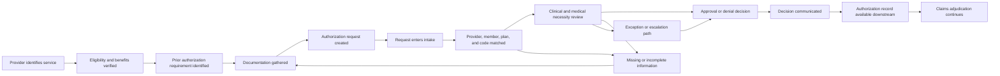

# Prior Auth Current State

```mermaid
flowchart LR
    provider["Provider identifies service"]
    eligibility["Eligibility and benefits verified"]
    requirement["Prior authorization requirement identified"]
    documentation["Documentation gathered"]
    request["Authorization request created"]
    intake["Request enters intake"]
    matching["Provider, member, plan, and code matched"]
    review["Clinical and medical necessity review"]
    decision["Approval or denial decision"]
    notification["Decision communicated"]
    record["Authorization record available downstream"]
    claims["Claims adjudication continues"]

    missing["Missing or incomplete information"]
    escalation["Exception or escalation path"]

    provider --> eligibility --> requirement --> documentation --> request --> intake --> matching --> review --> decision --> notification --> record --> claims
    matching --> missing --> documentation
    review --> missing
    review --> escalation --> decision
```
