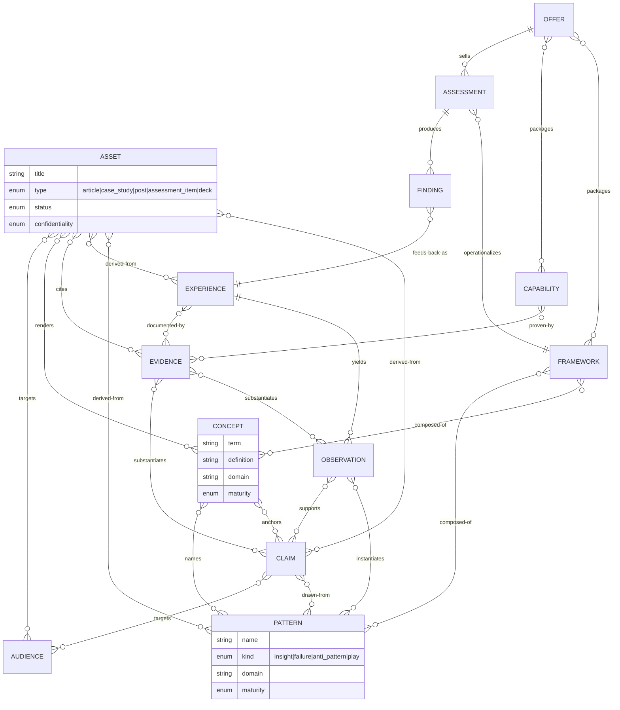

# TIF Knowledge Architecture Review

Status: Pre-implementation challenge
Role: Principal Knowledge Architect / Information Architect (not engineering)
Subject: The proposed domain model in `ENGINEERING_BACKLOG.md`
Reviewed against: `docs/DATA_MODEL.md`, `docs/PRD.md`, `docs/OFFER_ARCHITECTURE.md`, `docs/CONTENT_STRATEGY.md`

---

## 1. Verdict

**The proposed model — `Experience → Observation → Pattern → FailureMode` — is not sufficient, and more importantly it is the wrong *shape*.**

It fails in three structural ways:

1. **It is a linear chain modeling a graph.** Knowledge does not flow in one direction. A Pattern is not the child of a single Observation from a single Experience — it is a generalization *across* many Experiences. Modeling this as a 1→N pipeline will ossify the most valuable relationship in the system (cross-experience synthesis) into the one thing a chain cannot express.

2. **It models only the raw material, not the product.** The stated mission is "convert operational experience into reusable intellectual property and revenue-generating assets." The MVP core (`Experience, Observation, Pattern, FailureMode`) contains **no asset, no claim, no concept, no audience, and no offer**. It is the input hopper of a factory with no machine and no loading dock. The Gate Checkpoint declares success when these four entities exist — but none of them is the thing the business sells.

3. **It buries the crown-jewel IP.** TKO's actual intellectual property is its *proprietary vocabulary and point of view*: "Human API," "Administrative Burden as decision latency," "Operational Truth," "Decision Layer." These are named **Concepts** and defensible **Claims**. The proposed model has nowhere to put them. They would be smeared across free-text `narrative` and `description` fields and become un-reusable — the exact opposite of the mission.

`FailureMode` also should not be a peer entity at all (see §4).

---

## 2. Answers to the 12 questions

**1. Is `Experience → Observation → Pattern → FailureMode` sufficient?**
No. It is a provenance spine for *captured* knowledge, but it stops exactly where the business value starts. It has no synthesis layer (Concept, Claim), no proof layer (Evidence, in MVP), and no production layer (Asset, Audience, Offer).

**2. What knowledge is impossible to represent today?**
- **Named ideas / proprietary terms** ("Human API") — the brand IP. No `Concept` entity.
- **A point of view** ("Unmanaged dependency, not the operator, is the risk") — an assertion that gets reused across 20 assets. No `Claim`/`Thesis` entity.
- **Cross-experience patterns** — possible only as a degraded many-to-one, not the many-to-many reality.
- **Proof** — Evidence is deferred to Epic 6, so nothing in the MVP can substantiate a claim, which is fatal for case studies and healthcare proof assets.
- **The produced asset itself** and which knowledge it was derived from.
- **Who the knowledge is for** (Audience/ICP).
- **Confidentiality / anonymization state** — there is no way to mark client-identifying material, which is a hard requirement before any healthcare experience becomes public content.

**3. What entities are missing?**
`Concept`, `Claim` (Thesis/Assertion), `Evidence` (must move to MVP), `Asset` (Output), `Audience` (ICP/Buyer), `Offer`. Later: `Framework`, `Capability`, `GovernanceModel`, `Decision`, and the entire assessment-delivery graph already drafted in `DATA_MODEL.md`.

**4. Should `Evidence` exist?** Yes — and in the **MVP, not Epic 6**. Credibility is the product. A case study or proof asset with no linked evidence is a liability, especially in healthcare. Evidence is the entity that lets a `Claim` be defended.

**5. Should `Story` exist?** **No, not as a first-class core entity.** A "Story" is a *rendering* of an Experience + Pattern + Claim for an Audience — i.e. it is an **Asset** (subtype `case_study` / `narrative`). Promote `Asset` with a `type`; do not create a parallel `Story` entity that duplicates Experience. (Epic 8's "Story Library" is an Asset collection, not a new noun.)

**6. Should `Capability` exist?** Yes — in **expansion**, not MVP. A Capability ("we can design a decision layer") is what an `Offer` sells, proven by `Evidence` and `Experience`. It is the bridge between knowledge and commerce, but it is not needed to ship the first asset.

**7. Should `Framework` exist?** Yes — **expansion**. A Framework is a structured, reusable method composed of Concepts, Patterns, and Decisions (e.g. the Human API Risk Score method). It is reusable IP, but the first publishable article does not require it.

**8. Should a `Governance Model` exist?** Yes, but **narrowly**. In this domain "governance" is *subject-matter content* (decision rights, escalation, controls) that TKO diagnoses and sells. Model it as a **Framework subtype** or a `GovernanceModel` expansion entity. Do **not** confuse it with system-level content governance (that is a lifecycle attribute — see §5 status/confidentiality).

**9. What relationships should exist?** See §6. The load-bearing ones the current model lacks: Observation **supports** Claim (M:N), Pattern **generalizes** many Observations across many Experiences (M:N), Evidence **substantiates** Observation/Claim/Capability (M:N), Asset **derived-from** Pattern/Claim/Experience (M:N), Asset/Claim **targets** Audience, and Finding **feeds back as** Experience (the missing learning loop).

**10. What would a mature architecture look like?** A three-zone knowledge graph — **Source → Knowledge → Product** — with a closed feedback loop from delivery (Findings) back into Source (Experience). See §5–§7.

**11. What supports the four thinking domains?**
All four — Human API, Administrative Burden, Transformation Recovery, AI Adoption — are the **same shape**: a named `Concept`, a set of `Pattern`s (mostly failure-polarity), a set of `Claim`s, backed by `Evidence`, rendered as `Asset`s, packaged into `Offer`s/`Assessment`s. This is the strongest argument that the model is currently mis-shaped: four flagship "libraries" in the backlog are not four schemas, they are four *values of a `Concept.domain` facet* over one graph.

**12. How should the model support future revenue?**
By making the value chain **traceable end to end**: every `Asset` and `Offer` links back through `Claim → Pattern → Observation → Experience → Evidence`. That lets you (a) generate assets from knowledge instead of from scratch, (b) prove any commercial claim, (c) reuse one Concept across content, assessment, and offer, and (d) measure which captured experience actually produced revenue.

---

## 3. Recommended Ontology

Three zones, one graph, one feedback loop.

```
  ZONE A — SOURCE              ZONE B — KNOWLEDGE                 ZONE C — PRODUCT
  (provenance / proof)         (durable, reusable IP)             (revenue assets)

  Experience  ───yields──▶  Observation ──supports──▶ Claim ──▶  Asset ──targets──▶ Audience
      │                        │                        ▲          │
      │                        │ instantiates           │          │ advances
      ▼                        ▼                        │          ▼
  Evidence ──substantiates──▶ Pattern ◀──names── Concept ──used-in──▶ Offer
   (M:N to                  (kind: insight |              │           │ packages
    Obs/Claim/                failure/FailureMode)        │           ▼
    Capability/Asset)                                  Framework ──operationalized-by──▶ Assessment
                                                          ▲                                │
                                                       Capability ◀──proven-by── Evidence  │ produces
                                                                                           ▼
                                                                                   Finding ──feeds-back──▶ Experience
                                                                                   (closes the loop)
```

**Principles encoded in this ontology**
- **Observation is the atom.** Everything sourced is an Observation; everything else is synthesis over Observations.
- **Pattern absorbs FailureMode** as a polarity, not a downstream child (§4).
- **Concept is the brand.** Proprietary terms are first-class so they can be reused and protected.
- **Claim is the unit of reuse.** A point of view is stated once and rendered into many Assets.
- **Asset is the product.** The MVP must be able to produce one.
- **The loop is mandatory.** Delivery Findings become new Experience — the factory learns from what it sells.

---

## 4. Why `FailureMode` is not a peer entity

Compare the backlog's own field lists:

| Pattern | FailureMode |
|---|---|
| symptoms | indicators |
| root_causes | causes |
| consequences | impacts |
| mitigations | remediation |

These are the same entity described twice. A FailureMode **is a Pattern** whose polarity is negative. Modeling them as peers forces:
- duplicated capture, divergent vocabularies, and reconciliation work;
- an arbitrary `Pattern → FailureMode` edge that implies failures are downstream of patterns (they are not — a failure mode *is* a pattern);
- two CRUD stacks, two APIs, two libraries (TIF-104/204/304) for one concept.

**Recommendation:** one `Pattern` entity with `kind ∈ {insight, failure, anti_pattern, play}`. "FailureMode" becomes `Pattern{kind: failure}`. This deletes an entity, an API, and a UI surface while *increasing* expressiveness.

---

## 5. Entity Definitions

### Zone A — Source

**Experience** — A bounded body of operational reality TKO lived through: an engagement, role, program, or episode (Optum, Cognizant, RachelOS, a prior-auth modernization, small-business ops). The raw material. *Key attributes:* title, type (engagement | role | program | venture | incident), domain, organization (may be anonymized), period, narrative, confidentiality, status. *Provenance root.*

**Evidence** — A concrete artifact that substantiates a knowledge object: a repo, screenshot, document, metric, quote, reference. **MVP, not Epic 6.** *Key attributes:* title, type (artifact | metric | quote | document | repo | reference), uri/location, source, confidentiality, verifiability (verified | self-reported | anecdotal). The thing that turns an assertion into a defensible Claim.

### Zone B — Knowledge

**Observation** — The atomic, sourced statement of something that was true in an Experience ("PA exceptions were routed through one nurse's inbox"). *Key attributes:* statement, context, confidence, polarity, anonymization_status, tags. Always traces to ≥1 Experience.

**Concept** — A named, defined idea that is part of TKO's proprietary vocabulary ("Human API," "Operational Truth," "Decision Latency"). **The crown-jewel IP.** *Key attributes:* term, definition, domain (human_api | admin_burden | transformation_recovery | ai_adoption | governance | visibility), aliases, canonical_claim, maturity (working | public | flagship). Concepts are what make the content recognizably TKO.

**Pattern** — A recurring operational structure generalized across Experiences (absorbs FailureMode). *Key attributes:* name, kind (insight | failure | anti_pattern | play), description, indicators/symptoms, causes, consequences, mitigations, domain, maturity. Connects to many Observations across many Experiences (M:N).

**Claim** — A defensible point of view / assertion intended for reuse ("Unmanaged dependency on key people is the operating risk, not the people"). The unit of thought leadership. *Key attributes:* statement, stance, strength (hypothesis | supported | validated), domain, status. Drawn from Patterns/Observations; substantiated by Evidence; targeted at an Audience.

**Framework** *(expansion)* — A structured, reusable method (the Human API Risk Score method, the Decision Layer design). Composed of Concepts, Patterns, and Decisions. *Key attributes:* name, purpose, workflow/steps, components, examples, maturity.

**Capability** *(expansion)* — Something TKO can reliably do, sold via Offers and proven by Evidence/Experience. *Key attributes:* name, description, maturity, proof (→Evidence).

**GovernanceModel** *(expansion, Framework subtype)* — A reusable decision-rights/escalation/controls model that TKO diagnoses and prescribes. *Key attributes:* scope, decision_rights, approval_model, escalation_model, controls.

**Decision** *(expansion)* — A judgment with rationale, alternatives, outcomes — reusable IP for the Decision Layer offer and a bridge to the assessment-delivery `Decision` in `DATA_MODEL.md`.

### Zone C — Product

**Audience** — An ICP segment or buyer role the IP is for (VP UM, Chief Transformation Officer, COO, health-tech delivery lead). *Key attributes:* name, role, segment (payer_ops | transformation | health_tech | consulting_partner), pains, channel. Sourced directly from `PRD.md` / `OFFER_ARCHITECTURE.md`.

**Asset** — A produced, publishable/sellable output rendered from knowledge: article, case study, LinkedIn post, assessment question set, diagnostic, deck, one-pager. **This is the product; it belongs in MVP.** *Key attributes:* title, type (article | case_study | linkedin_post | essay | assessment_item | deck | one_pager | offer_brief), status (draft | review | published | retired), audience, body, source_refs (→ Claims/Patterns/Experiences/Evidence), confidentiality. "Story" is `Asset{type: case_study}` — not a separate entity.

**Offer** *(expansion)* — A commercial package (Human API Recovery Assessment, Decision Layer Build Sprint, Fractional Advisor). *Key attributes:* name, audience, problem, deliverables, timeline, price_range, ladder_position. Packages Frameworks + Capabilities + Assessments.

**Assessment** *(expansion → bridge to `DATA_MODEL.md`)** — The diagnostic instrument/product that operationalizes a Framework and, when delivered, produces Findings that feed back into Experience. This is the seam where the knowledge-factory graph connects to the existing assessment-delivery graph (Organization, Workflow, Human API, Dependency, Risk, Finding, Recommendation, Action Plan).

### Cross-cutting lifecycle attributes (every Zone A/B/C entity)
- **status / maturity** — capture → refined → published/retired. Without this, the system cannot tell raw notes from shippable IP.
- **confidentiality / anonymization_status** — `internal | client_confidential | anonymized | public`. **Non-negotiable** before any healthcare experience becomes content. This is the real "content governance."
- **domain facet** — the value (human_api, admin_burden, …) that makes the four flagship "libraries" views over one graph instead of four schemas.

---

## 6. Relationship Model

| From | Relationship | To | Card. | Notes |
|---|---|---|---|---|
| Experience | yields | Observation | 1:N | provenance spine |
| Evidence | substantiates | Observation / Claim / Capability / Asset | M:N | proof layer (MVP) |
| Observation | instantiates | Pattern | M:N | **cross-experience** synthesis |
| Observation | supports | Claim | M:N | evidence for a POV |
| Concept | names / anchors | Claim, Pattern | M:N | proprietary vocabulary |
| Pattern | generalizes | Observation | M:N | (inverse of instantiates) |
| Claim | drawn-from | Pattern | M:N | |
| Claim | targets | Audience | M:N | who it's for |
| Framework | composed-of | Concept / Pattern / Decision | M:N | expansion |
| Capability | proven-by | Evidence / Experience | M:N | expansion |
| Asset | derived-from | Claim / Pattern / Experience / Evidence | M:N | traceability to source |
| Asset | targets | Audience | N:1+ | distribution |
| Asset | renders | Concept | M:N | reuse of vocabulary |
| Offer | packages | Framework / Capability / Assessment | M:N | commerce |
| Assessment | operationalizes | Framework | N:1 | bridge |
| Assessment | produces | Finding | 1:N | → DATA_MODEL graph |
| **Finding** | **feeds-back-as** | **Experience** | **N:1** | **closes the learning loop** |

The three relationships the current backlog cannot express and most needs: **Observation↔Pattern (M:N cross-experience)**, **Evidence↔{Observation,Claim} (M:N proof)**, and **Finding→Experience (feedback loop)**.

---

## 7. ERD



---

## 8. Risks

**R1 — Wrong thing declared "done" (highest).** The Gate Checkpoint defines MVP success as four input entities existing, before any Asset can be produced. The business is explicitly "not successful because software exists" — yet the gate certifies exactly that. *Mitigation:* move the gate to "one publishable Asset generated, end to end, from real Experience with linked Evidence."

**R2 — Linear pipeline ossifies a graph.** Building `Experience→Observation→Pattern→FailureMode` as 1:N foreign keys makes cross-experience patterns and multi-source claims expensive to retrofit. *Mitigation:* model Observation↔Pattern and Evidence↔Claim as M:N from day one.

**R3 — Entity duplication (Pattern/FailureMode).** Two near-identical entities, APIs, and UIs for one concept. *Mitigation:* collapse via `Pattern.kind`.

**R4 — Evidence deferred to Epic 6.** Case studies (Epic 7) and healthcare proof assets (Epic 8) are built *before* the entity that substantiates them. *Mitigation:* promote Evidence to MVP.

**R5 — No confidentiality/anonymization model.** Healthcare/payer client material has no provenance-safety attribute; the first time someone generates a LinkedIn post from an Optum experience, there is no system control preventing disclosure. *Mitigation:* `confidentiality` + `anonymization_status` on every Source/Knowledge/Product entity, in MVP.

**R6 — Invisible IP.** No Concept/Claim entities means the proprietary vocabulary and POV — the actual moat — live in free text and cannot be reused or governed. *Mitigation:* Concept + Claim in MVP.

**R7 — Two disconnected ontologies.** The factory graph and the `DATA_MODEL.md` assessment graph never meet; the learning loop (Findings → Experience) is absent, so delivery never refines the IP. *Mitigation:* define the Assessment/Framework/Finding bridge now, build it in expansion.

**R8 — Over-engineering the scaffold, under-engineering the value.** 90% coverage mandates on CRUD for input entities spends the build budget on plumbing the backlog itself warns against, while the asset-generation value chain is unmodeled. *Mitigation:* thin vertical slice (one asset, end to end) over broad horizontal CRUD.

**R9 — "Story" as a parallel entity.** Epic 8's Story Library invites a `Story` table that duplicates Experience+Asset. *Mitigation:* Story = `Asset{type: case_study}`.

---

## 9. Revised MVP Schema (logical — no code)

Goal of MVP: **produce one publishable Asset, end to end, from real captured Experience, with traceable proof.** That is the smallest thing that demonstrates the factory, and it is the gate.

**Entities (8):**

1. **Experience** — title, type, domain, organization, period, narrative, lessons, confidentiality, status, tags
2. **Observation** — experience_ref, statement, context, confidence, polarity, anonymization_status, tags
3. **Concept** — term, definition, domain, aliases, canonical_claim_ref, maturity *(NEW — crown-jewel IP)*
4. **Pattern** — name, **kind** (insight|failure|anti_pattern|play), description, indicators, causes, consequences, mitigations, domain, maturity *(absorbs FailureMode)*
5. **Claim** — statement, stance, strength, domain, status *(NEW — unit of reuse)*
6. **Evidence** — title, type, uri, source, verifiability, confidentiality *(promoted from Epic 6)*
7. **Asset** — title, type, status, body, confidentiality, audience_ref *(NEW — the product)*
8. **Audience** — name, role, segment, pains, channel *(NEW; may begin as a controlled vocabulary, promoted to a table)*

**Relationships (M:N unless noted):**
- Experience 1→N Observation
- Observation ↔ Pattern (instantiates, cross-experience)
- Observation ↔ Claim (supports)
- Evidence ↔ Observation, Evidence ↔ Claim (substantiates)
- Concept ↔ Claim, Concept ↔ Pattern (anchors/names)
- Asset ↔ {Claim, Pattern, Experience, Evidence} (derived-from / cites)
- Asset → Audience (targets)

**Cross-cutting on every entity:** `status` (capture|refined|published), `confidentiality` (internal|client_confidential|anonymized|public), `domain` facet.

**Explicitly deferred out of MVP:** Framework, Capability, GovernanceModel, Decision, Offer, Assessment, vectors. They are real, but not required to ship the first asset.

---

## 10. Future Expansion Schema (logical — no code)

**Phase 2 — Reusable IP structures**
- **Framework** (composed-of Concept/Pattern/Decision)
- **Capability** (proven-by Evidence/Experience)
- **GovernanceModel** (Framework subtype: scope, decision_rights, approval_model, escalation_model, controls)
- **Decision** (decision, rationale, alternatives, outcomes) — bridges to delivery

**Phase 3 — Commerce**
- **Offer** (packages Framework/Capability/Assessment; audience, deliverables, timeline, price_range, ladder_position)
- **Asset** types extend to offer_brief, executive_briefing, interview_guide, risk_tier_explainer

**Phase 4 — Delivery bridge (connect to `DATA_MODEL.md`)**
- **Assessment** (operationalizes Framework; produces Finding)
- Import the assessment-delivery graph: Organization, BusinessFunction, Workflow, System, HumanAPI, Dependency, Risk, Finding, Recommendation, ActionPlan
- **Finding → Experience** feedback edge (closes the loop: delivery refines the IP)

**Phase 5 — Intelligence**
- Embeddings on Observation, Pattern, Claim, Concept, Asset for similarity ("have I seen this before?", "what patterns relate?", "what assets cite this Concept?")
- Related-content engine over the graph rather than over text

---

## 11. One-paragraph recommendation

Keep the discipline of the backlog (structured, tested, phased, anti-CMS) but **re-shape the core from a 4-entity input chain into an 8-entity value graph that can actually emit a product.** Specifically: collapse `FailureMode` into `Pattern.kind`; add `Concept`, `Claim`, and `Asset` (and `Audience`) to the MVP; pull `Evidence` forward from Epic 6; make `Observation↔Pattern` and `Evidence↔Claim` many-to-many; put `confidentiality`/`anonymization` on everything; and move the Gate Checkpoint from "four entities exist" to "one publishable asset generated from real experience with linked proof." Defer Framework/Capability/Offer/Assessment to expansion, and define — now — the `Assessment → Finding → Experience` bridge that connects this factory to the existing `DATA_MODEL.md` and lets delivery feed the IP back into itself.
```

---

## 12. Addendum — Registry & Artifact Engine alignment (TIF v2)

Added 2026-06-25 to align this data-model authority with the v2 architecture in
[`/TKO_INTELLIGENCE_FACTORY_PRD.md`](../TKO_INTELLIGENCE_FACTORY_PRD.md). **The 8-entity MVP
knowledge graph (§5, §9) does not change.** v2 adds a runtime delivery spine and a
configuration layer *around* it, and renames one term.

**1. `Asset` → `Artifact` (terminology).** The Zone C product node this review calls `Asset`
is renamed **`Artifact`** to match the Artifact Registry. Same node, same `type` facet
(`article | case_study | one_pager | diagram | …`); "Story = `Asset{type: case_study}`"
becomes "Story = `Artifact{type: case_study}`." `Diagram` is simply `Artifact{type: diagram}`.

**2. Runtime delivery spine (new layer — operationalizes the §6 `Assessment→Finding→Experience`
bridge).** These are per-engagement runtime records, distinct from the durable knowledge graph:

| Entity | Traces to | Notes |
|---|---|---|
| `Run` | — | engagement/job container: `{framework, subject, voice, inputs}` |
| `Question` | Framework | from `docs/QUESTION_LIBRARY.md`, owned by a framework |
| `Answer` | Question, Run | captured response |
| `Evidence` | Answer · Experience · external | **already MVP** (§5); now also sourced from Answers |
| `Finding` | Evidence[] | carries `confidence`, optional `risk_tier` |
| `Recommendation` | Finding[] | carries priority/effort |
| `Artifact` | Findings/Recommendations/Evidence/Claims | **already MVP** as Asset |

Mandatory traceability chain (enforced, blocks generation if broken):
`Question → Answer → Evidence → Finding → Recommendation → Artifact`, plus the existing
`Finding → Experience` feedback edge. This is the §2/§6 "load-bearing relationships" extended
through delivery. **Confidence** is mandatory on `Finding` and `Artifact` (aggregated from
Evidence `verifiability`) — the concrete implementation of the §5 "credibility is the product."

**3. Configuration registries (new — config, NOT graph nodes).** `FrameworkDefinition`,
`ArtifactType`, `VoiceProfile`, and `PromptDefinition` are versioned configuration (repo files →
tables), consumed by one `compose()` engine. They are the anti-`per-output-generator` mechanism:
new businesses (Rachel relocation, CRE) are new `FrameworkDefinition`/`VoiceProfile` rows, not new
schemas. The §3 ontology's `Framework`/`Capability`/`Offer` expansion entities remain the
*knowledge* representations; the registries are their *runtime configuration* counterparts.

**3A. Execution Layer (v0.3 — runtime contract, NOT graph nodes).** The registries are executed
through:

```
Payload → Validation → Framework → Artifact → Fact Resolution → Template Population → Draft
Generation → Voice Refinement → Review → Approval → Publish
```

This layer introduces a deterministic contract around `compose(framework, artifact, voice, facts)`.
It does not add a peer to the durable knowledge graph and does not authorize per-output generators.
The conceptual Fact Resolution Layer prepares generation context and blocks unsupported claims
before draft generation.

**4. No conflict with §8 risks.** This addendum directly satisfies R1 (gate = produced artifact
with traceability), R4 (Evidence in MVP), R6 (Concept/Claim reusable), and R7 (factory graph
meets the delivery graph). It introduces no new peer to `Pattern`/`FailureMode` (R3 holds:
`FailureMode` stays collapsed into `Pattern.kind`).

## 13. Addendum — Content Operating Model alignment

Added 2026-07-01 to align the knowledge architecture with the TIF content operating model in
[`docs/TIF_CONTENT_OPERATING_MODEL.md`](TIF_CONTENT_OPERATING_MODEL.md). **The durable knowledge
graph does not change.** This is terminology and planning alignment only.

The strategy model is:

```text
Knowledge → Insight → Deliverable → Channel Package → Publication → Measurement
```

Mapping to this review:

- **Knowledge** includes Source and Knowledge-zone material: Experience, Evidence, Observation,
  Concept, Pattern, Claim, and external source artifacts. `Evidence` remains the proof-grade subset
  of Knowledge and should not be renamed away.
- **Insight** is the reusable content-strategy expression of Claims, Patterns, Findings, and
  Recommendations. A run-specific Finding can become a reusable Insight after review.
- **Deliverable** is the strategy/backlog term for the producible object. It maps to the prior
  `Asset` / v2 `Artifact` node when the system needs a stored output or registry contract.
- **Channel Package** is a channel-specific adaptation of a Deliverable. It may also be represented
  as an `ArtifactType` when generated by the composer.
- **Publication** is downstream placement/rendering owned by publication layers.
- **Measurement** closes the loop by feeding performance, coverage, freshness, and conversion
  signals back into future Knowledge/Insight/Deliverable priorities.

Comparison is a first-class Deliverable archetype/type. A `comparison_page` or `comparison_guide` is
not the whole concept; it is a channel/package or publication form of a Comparison deliverable.
