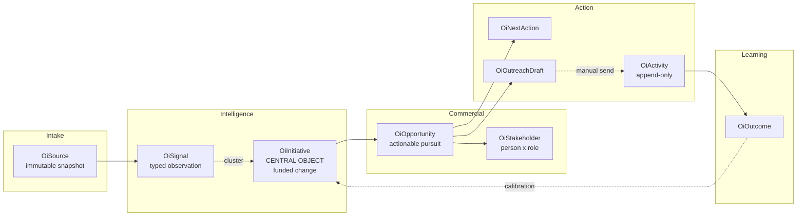
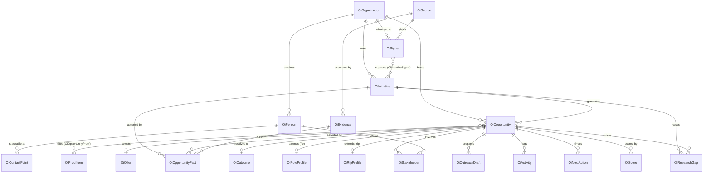
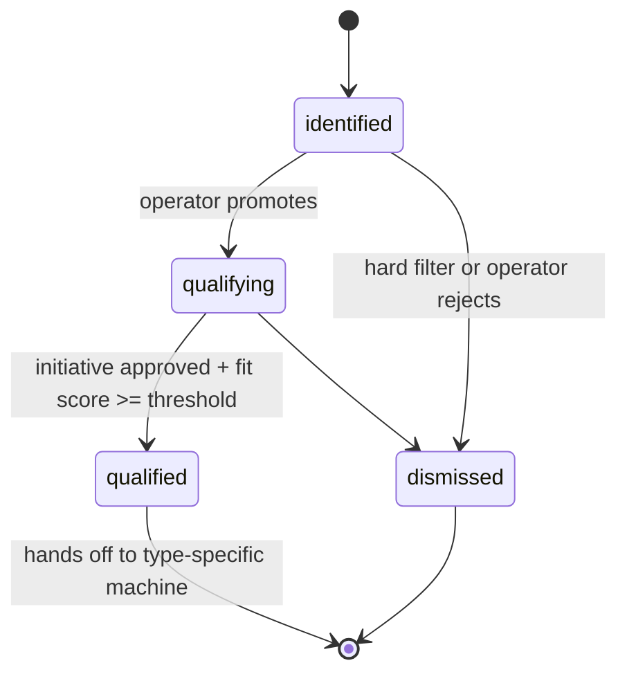
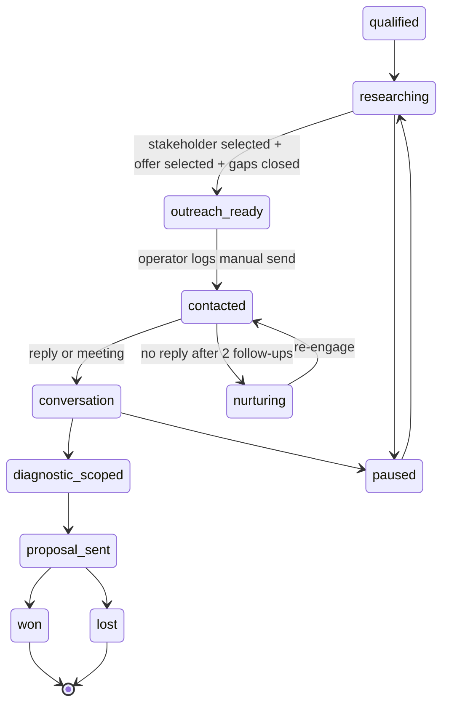
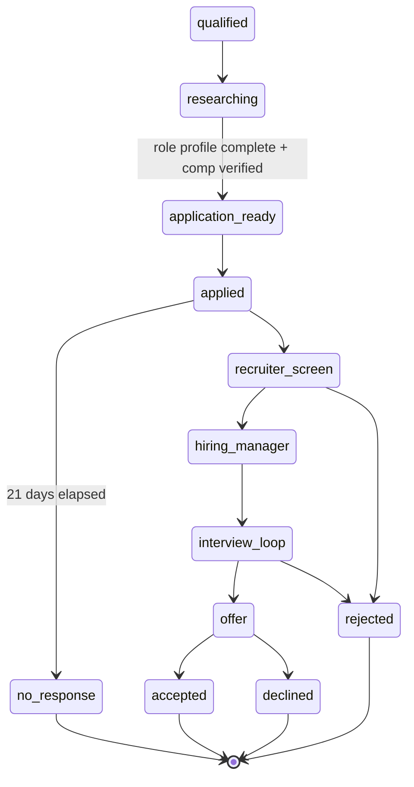
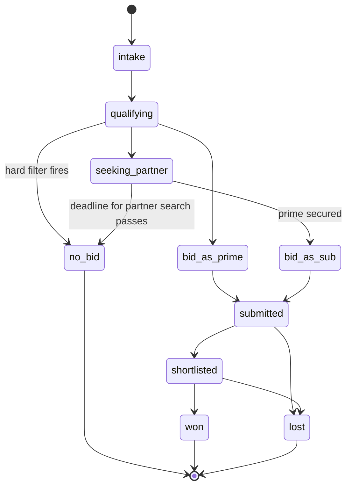
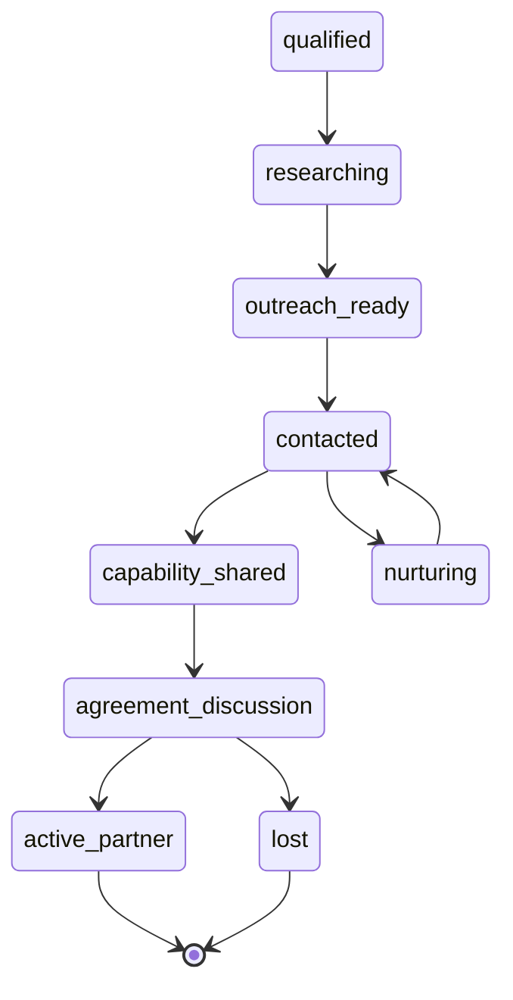
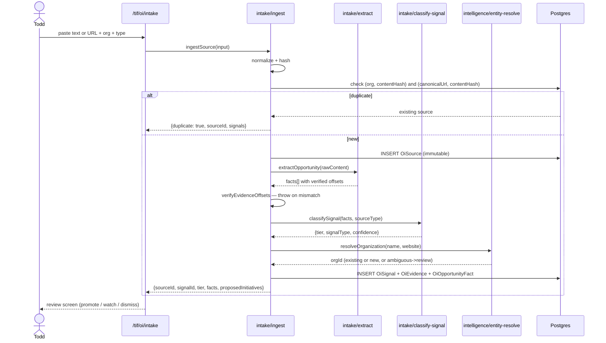
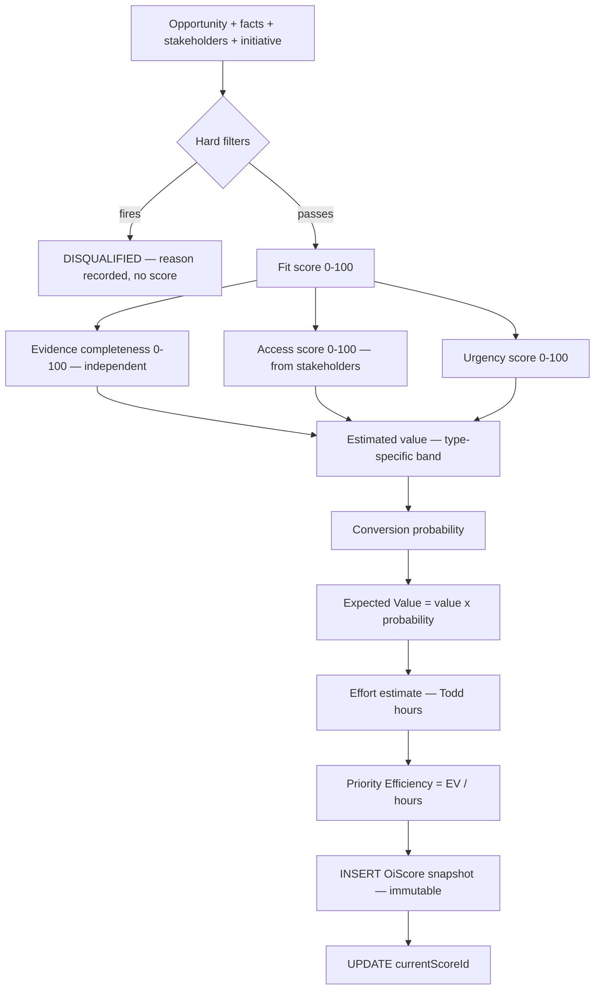

# POIS Target Architecture

**System:** Personal Opportunity Intelligence System
**Date:** 2026-07-31
**Status:** Architecture baseline for Codex implementation
**Companion docs:** `PERSONAL-OPPORTUNITY-OPERATING-SYSTEM.md` (why), `POIS-DATA-MODEL.md`
(what is stored), `POIS-CODEX-IMPLEMENTATION-PLAN.md` (how it gets built)

---

## 1. Current repository architecture (verified)

Everything in this section was verified against code on 2026-07-31, not against
documentation. Where documentation and implementation disagree, implementation wins and the
disagreement is noted.

### 1.1 Platform

| Concern | Implementation | File |
|---|---|---|
| Framework | Next.js 15.5 App Router, React 19, Turbopack | `package.json` |
| Database | PostgreSQL (Neon) via Prisma 7.8 + `@prisma/adapter-pg` | `prisma/schema.prisma` |
| Prisma client | **Two singletons** — `prisma` and `tifDb` | `src/lib/db/prisma.ts`, `src/lib/tif/db.ts` |
| Validation | Zod 4 (available, lightly used) | `package.json` |
| Tests | Vitest 4, 26 test files, jsdom + Testing Library | `package.json` |
| Private access | Access-key middleware on `/tif/*`, fail-closed | `src/middleware.ts` |
| Email | Resend via raw `fetch` (no SDK dependency) | `src/lib/leads/notify.ts:30` |
| Migrations | 9 applied, latest `20260730010026_add_opportunity_intelligence_a1` | `prisma/migrations/` |
| Scheduled jobs | **None.** `vercel.json` declares no crons | `vercel.json` |
| AI client | **None exists** | verified by grep across `src/`, `scripts/` |

**Correction to prior documentation:** `docs/TIF-CURRENT-STATE-ASSESSMENT.md` (2026-07-31)
states that opportunity extraction is "Claude-based." **This is false.** Extraction is
100% deterministic regex and keyword matching (`src/lib/opportunity-intelligence/extract.ts`).
No AI client exists anywhere in the codebase. The env vars `ANTHROPIC_API_KEY`,
`OPENAI_API_KEY`, `AI_PROVIDER`, `AI_MODEL_FAST`, `AI_MODEL_QUALITY`, `AI_DRAFT_TIMEOUT_MS`
are declared in `.env.local` and referenced by **zero lines of code**. AI capability is
greenfield.

Two other env vars are provisioned and unused: `CRON_SECRET`, `INTERNAL_API_KEY`. They are
available for Slice 8+ scheduled work without new provisioning.

### 1.2 Authentication and privacy

`src/middleware.ts` gates `/tif/:path*`:
- Fails closed with HTTP 503 if `TIF_ACCESS_KEY` is unset.
- Accepts an httpOnly cookie or HTTP Basic auth; sets an 8-hour cookie on Basic success.
- Redirects unauthenticated requests to `/tif/login` preserving a `next` param.

All POIS routes mount under `/tif/` and inherit this for free. All POIS pages must also set
`robots: { index: false, follow: false }`, matching the existing TIF page convention.

**This is adequate for one operator and inadequate for two.** Adding any second user
requires real authentication first.

### 1.3 Opportunity Intelligence — what is actually implemented

Two disconnected halves, delivered in two migrations one day apart.

**Half A — person-first pursuit queue** (`20260729183000`, `src/lib/oi.ts`, 400+ lines)

- `OiOrganization`, `OiPerson`, `OiPursuit`.
- `scoreOpportunity()` — deterministic `oi-v1` policy, clamped 0–100, producing components,
  warnings, a `readiness` verdict (`blocked` | `research_ready` | `contact_ready`), and a
  next-action **string**. Includes genuinely good logic: seniority gate, authority penalty,
  source-freshness penalty (12-month staleness), do-not-contact suppression.
- `OI_STARTER_PEOPLE` seed cohort across UnitedHealthcare, Elevance, Humana, Availity, Epic.
- UI: `/tif/opportunities` — ranked pursuit list, bootstrap, status transitions, contact-path
  capture.

**Half B — opportunity-first source ingestion** (`20260730010026`,
`src/lib/opportunity-intelligence/`)

- `OiSource` (immutable), `OiOpportunity`, `OiEvidence`, `OiOpportunityFact`,
  `OiResearchGap`, `OiOpportunityScore`.
- `ingestPastedOpportunity()` — transactional; content-hash dedupe; canonical-URL
  reconciliation; verified evidence offsets; operator-override preservation across reruns;
  append-only score snapshots with a nullable current pointer updated only after creation.
- `extractOpportunity()` — deterministic, 8 fact fields, offsets verified by
  `verifyEvidenceOffsets()`.
- `scoreOpportunityFit()` — deterministic `opportunity-fit-v1`, **max 100 points**
  (20+20+15+10+10+10+10+5), plus an independent completeness percentage.
- `planResearchGapReconciliation()` — gap lifecycle that does not reopen operator-resolved
  gaps on rerun.
- UI: `/tif/opportunities/sources` — paste form and opportunity brief.

**The defect:** `OiPursuit` has **no foreign key to `OiOpportunity`**. Half A and Half B
share only `OiOrganization`. There is no path from a pasted source to a person-specific
commercial motion. This is the single most important thing the target architecture fixes.

### 1.4 Verified capability inventory

| Capability | Status | Evidence |
|---|---|---|
| Private operator shell | **Implemented, usable** | `src/middleware.ts` |
| Immutable source + hash dedupe | **Implemented, usable** | `ingest.ts`, `sources/normalize.ts` |
| Deterministic extraction with offsets | **Implemented, usable** | `extract.ts`, `extract.test.ts` |
| Deterministic opportunity-fit score | **Implemented, usable** | `score.ts`, `score.test.ts` |
| Research-gap lifecycle | **Implemented, usable** | `research-gaps.ts` |
| Append-only score snapshots | **Implemented, usable** | `ingest.ts:166` |
| Person-first pursuit scoring | **Implemented, disconnected** | `src/lib/oi.ts` — no opportunity link |
| Pursuit→Opportunity link | **Missing** | no FK in schema |
| Initiative | **Missing** | documented in requirements §11 as "future" |
| Signal | **Missing** | documented as "future" |
| Activity history | **Missing** | requirements §13 lists as not implemented |
| Next action (structured) | **Missing** | only a `String` field on `OiPursuit` |
| Stakeholder roles | **Missing** | no role model |
| Outreach draft | **Missing** | no model, no service |
| RFP fields | **Missing** | not in schema or docs |
| FTE fields (comp floor, remote, application) | **Missing** | not in schema |
| Today view | **Missing** | no route |
| AI client | **Missing** | greenfield |
| Contact points with provenance | **Partial** | 3 fields on `OiPursuit`, no lifecycle |
| Proof asset matching | **Missing** | proof exists as content, no tagging |

### 1.5 Blocking schema constraints

Four constraints in the current schema actively prevent the target model. Each requires a
migration in Slice 0.

| # | Constraint | Location | Blocks |
|---|---|---|---|
| C1 | `OiPursuit @@unique([personId, mode])` | `schema.prisma:518` | One person can hold only **one** consulting pursuit ever. Cannot pursue the same executive about two different initiatives. |
| C2 | `OiSource.opportunityId` is **required** | `schema.prisma:565` | A source cannot exist before an opportunity; one source cannot support multiple signals, initiatives, or opportunities. |
| C3 | `OiPursuit` has no `opportunityId` | `schema.prisma:490–522` | The two halves of the system cannot be joined. |
| C4 | `OiOpportunityStatus` = 4 states only | `schema.prisma:174` | No commercial progression; cannot represent conversation, proposal, interview, won, lost. |

Additionally `OiOpportunity` has **no `type` field**, so FTE, consulting, RFP, and
partnership opportunities are indistinguishable — the single largest functional gap.

---

## 2. Target architecture — overview

### 2.1 Guiding shape



### 2.2 Bounded contexts

Four contexts. Each owns its records, exposes a narrow service surface, and never reaches
into another's tables directly.

| Context | Owns | Directory | Depends on |
|---|---|---|---|
| **Intake** | `OiSource`, `OiSignal` | `src/lib/opportunity-intelligence/intake/` | nothing |
| **Intelligence** | `OiInitiative`, `OiEvidence`, `OiOpportunityFact`, `OiResearchGap`, `OiPerson`, `OiOrganization` | `src/lib/opportunity-intelligence/intelligence/` | Intake (read) |
| **Commercial** | `OiOpportunity`, `OiStakeholder`, `OiScore`, `OiNextAction`, `OiRfpProfile`, `OiRoleProfile` | `src/lib/opportunity-intelligence/commercial/` | Intelligence (read) |
| **Action** | `OiOutreachDraft`, `OiActivity`, `OiOutcome` | `src/lib/opportunity-intelligence/action/` | Commercial (read) |

Cross-context reads go through exported service functions, never through raw Prisma queries
against another context's models. This is a convention, not a compiler-enforced rule; it is
worth honoring because it is what will let Slice 7 (RFP) and Slice 6 (employment) be added
without touching intake or scoring.

**Existing TIF content code (`src/lib/tif/`) is not a dependency of any POIS context**,
with one exception: a read-only proof-matching adapter (§10).

---

## 3. Canonical records

Twenty canonical records. Eight exist and are preserved; two are refactored; one is retired;
nine are new.

| Concept | Canonical record | Disposition |
|---|---|---|
| Source | `OiSource` | **Preserve**, relax `opportunityId` to nullable (C2) |
| Signal | `OiSignal` | **New** |
| Account / organization | `OiOrganization` | **Preserve**, extend |
| **Buying initiative** | `OiInitiative` | **New — central intelligence object** |
| Opportunity | `OiOpportunity` | **Refactor** — add `type`, `initiativeId`, richer status |
| Person | `OiPerson` | **Preserve**, extend |
| Stakeholder relationship | `OiStakeholder` | **New** (person × opportunity/initiative × role) |
| Evidence / claim | `OiEvidence` + `OiOpportunityFact` | **Preserve**, retarget to initiative as well |
| Research gap | `OiResearchGap` | **Preserve**, allow initiative parent |
| Commercial hypothesis | fields on `OiInitiative` + `OiOpportunity` | **Refactor** — not a separate entity |
| Offer | `OiOffer` | **New** (small reference table, seeded) |
| Proof item | `OiProofItem` | **New** (thin pointer to existing content) |
| Activity | `OiActivity` | **New**, append-only |
| Next action | `OiNextAction` | **New** |
| Outreach draft | `OiOutreachDraft` | **New** |
| Application | fields on `OiRoleProfile` | **New**, FTE extension |
| Conversation | `OiActivity` with `type=conversation` | **New**, not a separate entity |
| Proposal | `OiActivity` with `type=proposal_sent` + `OiOutcome` | **New** |
| Engagement / role | `OiOutcome` | **New** |
| Outcome / learning | `OiOutcome` | **New** |
| Decision + prediction | `OiDecision` | **New** — data model §9.1 |
| Campaign | `OiCampaign` | **New** — data model §9.3 |
| Playbook | `OiPlaybook` | **New** — data model §9.4 |
| Generated artifact | `OiArtifact` | **New** — data model §9.5, replaces `OiOutreachDraft` |
| Weekly review | `OiWeeklyReview` | **New** — data model §9.6 |
| ~~Pursuit~~ | `OiPursuit` | **RETIRE** — see §4 |
| ~~Outreach draft~~ | `OiOutreachDraft` | **SUPERSEDED** by `OiArtifact` |

### 3.0 Derived, not stored — do not create these tables

Two canonical concepts have **no model**. Codex's default instinct will be to create tables
for both; it must not.

| Concept | Implementation | Spec |
|---|---|---|
| **Opportunity Timeline** | `buildTimeline()` merges `OiSignal` (via initiative), `OiActivity`, status-change activities, and `OiDecision`, sorted by date | Data model §9.7 |
| **Executive Brief** | `buildExecutiveBrief()` assembles from person facts, signals, initiatives, stakeholder data, playbook guidance, and research gaps at request time; optionally snapshotted into `OiArtifact` | Data model §9.8 |

Both are already fully expressible from existing tables. A stored copy would duplicate data and
immediately drift from it.

### 3.1 Why `OiPursuit` is retired

`OiPursuit` is not preserved. It is a flawed entity, and the brief is explicit that flawed
entities should not survive merely to avoid migration work. Concretely:

1. **Person-first by construction** — `personId` is required, so a pursuit cannot exist
   before a person is known. This contradicts the core operating principle.
2. **`@@unique([personId, mode])`** — structurally caps one consulting pursuit per person,
   forever.
3. **No link to `OiOpportunity`** — it cannot participate in the initiative model.
4. **Field duplication** — `problemHypothesis`, `fitHypothesis`, `evidenceSummary`, `score`,
   `nextAction`, `status` all belong on the opportunity, the stakeholder, or the next action.

**What is harvested rather than discarded:** the scoring logic in `src/lib/oi.ts` is good and
its ideas move into the new access/stakeholder scoring — seniority gating, budget/hiring
authority levels, relationship strength, source-confidence weighting, 12-month freshness
penalty, and do-not-contact suppression. `scoreOpportunity()` is refactored into
`scoreStakeholderAccess()`, not deleted (`POIS-SCORING-AND-DECISION-MODEL.md` §6).

**Migration:** each existing `OiPursuit` row backfills into one `OiOpportunity`
(`type` from `mode`) + one `OiStakeholder` + one `OiNextAction`. The table is retained but
unused for one release, then dropped. See §12.

---

## 4. Entity relationships and cardinalities

### 4.1 ERD



### 4.2 Explicit cardinalities

Answering the brief's §8.2 questions directly:

| Relationship | Cardinality | Rationale |
|---|---|---|
| Account → Initiative | **1 : many** | One payer runs many concurrent programs |
| Initiative → Opportunity | **1 : many** | One PA-modernization initiative yields an FTE role, a consulting assessment, and a partnership route |
| Opportunity → Initiative | **many : 0..1** | **Optional.** An opportunity may exist before an initiative is inferred (e.g., a cold RFP). Never blocks creation. |
| Source → Signal | **1 : many** | One long article can yield a leadership-change signal *and* a stalled-program signal |
| Signal → Initiative | **many : many** (`OiInitiativeSignal`) | A CMS-deadline signal supports several initiatives at once; an initiative is evidenced by several signals. **This join is the clustering mechanism.** |
| Source → Opportunity | **many : many** (`OiOpportunitySource`) | Replaces the required `OiSource.opportunityId` (C2) |
| Account → Opportunity | **1 : many**, required | Every opportunity has an account. Account-first, person-optional. |
| Person → Organization | **many : 1**, required | Simplification: one current employer. Historical roles are a deferred `OiPersonRole` (§13). |
| Opportunity → Stakeholder | **1 : many** | An opportunity has an economic buyer, an operational owner, and a hiring manager |
| Person → Stakeholder | **1 : many** | The same VP can be economic buyer on one opportunity and influencer on another — **role lives on the join, not the person** |
| Opportunity → Score | **1 : many**, plus `currentScoreId` pointer | Append-only history; existing pattern preserved |
| Opportunity → NextAction | **1 : many**, exactly one `status=open` | Enforced by partial unique index |
| Opportunity → Activity | **1 : many**, append-only | Never updated or deleted |
| Opportunity → Outcome | **1 : 0..1** | Created at close |
| Opportunity → RfpProfile / RoleProfile | **1 : 0..1** each | Type-specific extensions, not subclass tables |

**Does an opportunity support both employment and consulting paths?**
**No — create two opportunities under one initiative.** Their states, stakeholders, cycle
times, scoring formulas, and outcomes all differ. Forcing one record to carry both produces
a status enum that means nothing. The initiative is what ties them together, and the
workbench shows sibling opportunities on the same initiative so the relationship stays
visible.

---

## 5. State machines

Shared states are used **only where they carry identical meaning**. Where the commercial
process genuinely differs, the states differ.

### 5.1 Shared prefix (all opportunity types)



`identified → qualifying → qualified → dismissed` mean the same thing for every type. After
`qualified`, each type diverges.

### 5.2 Consulting / fractional / assessment



### 5.3 Full-time role



**Note the parallel track:** `applied` does not preclude direct stakeholder outreach. The
employment ladder runs application and direct outreach concurrently; the outreach is tracked
as `OiActivity` against the same opportunity.

### 5.4 RFP



RFP has its own intake because qualification is deadline-driven and mostly ends in `no_bid`.
The machine is designed to reach `no_bid` fast.

### 5.5 Partnership / subcontracting



### 5.6 Supporting lifecycles

**Initiative:** `hypothesized → evidenced → active → delayed → completed | cancelled`.
`hypothesized` is valid and useful but must never render as confirmed.

**Signal:** `captured → classified → promoted | watched | dismissed`.

**Outreach draft:** `draft → operator_review → approved_for_manual_use | changes_requested |
discarded`. **Approved means Todd may copy it. It never means sent.** Sending is an
`OiActivity` Todd logs.

**Transition rules (all machines):** every transition records actor, timestamp, and reason.
Backward transitions are permitted only into `paused` or `nurturing`. Terminal states
(`won`, `lost`, `accepted`, `declined`, `rejected`, `no_bid`, `dismissed`) require an
`OiOutcome` row.

---

## 6. Service boundaries

Directories are annotated by the milestone that creates them. **Do not create empty
directories ahead of their milestone** — `ai/` in particular arrives in Milestone 2, not
Milestone 0.

```
src/lib/opportunity-intelligence/     # M0 unless noted
  contracts.ts                    # PRESERVE — extend with new types
  capability-profile.ts           # PRESERVE — extend to todd-v2
  intake/
    normalize.ts                  # PRESERVE (move from sources/normalize.ts)
    ingest.ts                     # REFACTOR from ingest.ts
    extract.ts                    # PRESERVE — deterministic
    classify-signal.ts            # NEW — tier + type
  intelligence/
    initiative-inference.ts       # NEW — clustering (deterministic) + AI narrative
    research-gaps.ts              # PRESERVE
    stakeholder-suggest.ts        # NEW — role suggestion
    entity-resolve.ts             # NEW — org/person dedupe
  commercial/
    classify-opportunity.ts       # NEW — type from signal + facts
    score/
      policy.ts                   # NEW — versioned weights
      fit.ts                      # REFACTOR from score.ts
      access.ts                   # REFACTOR from src/lib/oi.ts scoreOpportunity()
      value.ts                    # NEW — value, probability, EV
      priority.ts                 # NEW — Priority Efficiency ranking
    next-action.ts                # NEW — deterministic next-action derivation
    lifecycle.ts                  # NEW — state machine guards
  action/
    decision.ts                   # M1 — decision journal (write side)
    timeline.ts                   # M1 — DERIVED, no model
    executive-brief.ts            # M2 — DERIVED, no model
    proof-match.ts                # M2 — reads TIF content (read-only)
    artifact-compose.ts           # M3 — AI-assisted artifacts (all kinds)
    claim-validator.ts            # M3 — blocks unsupported claims
    activity.ts                   # M3 — append-only log
    outcome.ts                    # M4
  queue/
    today.ts                      # M1 — bounded daily queue
    changes.ts                    # M1
  reporting/
    pipeline-summary.ts           # M1
    metrics.ts                    # M4 — scorecard
    weekly.ts                     # M4
    conversion.ts                 # M4 — advisory only
  ai/                             # M2 — DO NOT CREATE IN M0
    client.ts                     # M2 — provider adapter (greenfield)
    prompts/                      # M2 — versioned prompt templates
```

**Rules:**
- Route handlers and server actions are thin adapters. No extraction, scoring, or queue
  logic in `src/app/`.
- Every scoring function is **pure** — inputs in, score out, no I/O. This is what makes
  golden fixtures possible and is already the pattern in `score.ts`.
- Zod validates every external and AI-produced payload at the boundary.
- `src/lib/oi.ts` is deleted after its logic moves to `commercial/score/access.ts`.
- **Consolidate the two Prisma singletons.** `tifDb` and `prisma` are the same client
  configured twice. POIS uses `prisma` from `src/lib/db/prisma.ts`; `tifDb` is re-exported
  as an alias during transition.

---

## 7. Core flows

### 7.1 Ingestion



**Preserved guarantees** (already implemented, must not regress): transactional; idempotent
by content hash; evidence offsets verified against raw content; operator overrides survive
reruns; resolved research gaps do not reopen.

### 7.2 Initiative inference

Two-stage, and the split matters: **the deterministic stage decides, the AI stage explains.**

```
Stage 1 — deterministic clustering (authoritative)
  Input: new signal + all signals for the account in the last 180 days
  Match on: shared domain tags, temporal proximity (90d window), account
  Output: candidate initiative(s) with a deterministic confidence:
    0.45  single Tier 1 signal
    0.62  single Tier 1 + supporting Tier 2
    0.78  two Tier 1 signals within 90 days
    0.88  three or more related signals
    (Tier 2 alone caps at 0.40 and cannot auto-propose)

Stage 2 — AI narrative (advisory only, never authoritative)
  Input: clustered signals + their evidence excerpts
  Output: proposed initiative name, one-paragraph hypothesis, likely owner ROLES
  Constraints:
    - Cites only supplied excerpts
    - Never names a person as owner (roles only)
    - Confidence comes from Stage 1, never from the model
    - Output validated by Zod; failure degrades to Stage 1 only

Stage 3 — operator approval (required)
  Nothing becomes an initiative without Todd approving it.
```

If the AI provider is unavailable, ingestion still works and the initiative is proposed with
a deterministic name (`{Account} — {dominant domain tag} initiative`). **AI is never on the
critical path.**

### 7.3 Scoring



Every component persists `points`, `maxPoints`, and a human-readable `reason`. The Today
view renders these directly, which is how "why is A above B?" gets answered without a
separate explanation system.

Formulas and worked examples: `POIS-SCORING-AND-DECISION-MODEL.md`.

### 7.4 Stakeholder discovery

```
1. Suggest ROLES (deterministic, from initiative domain + opportunity type)
     PA modernization -> economic buyer: SVP Clinical Ops / VP UM
                      -> operational owner: Director PA Operations
                      -> technical owner: CIO / enterprise architect
                      -> hiring manager: (FTE only) posting's reporting line
2. Match existing OiPerson at the account against suggested roles
3. Operator adds named candidates (manual research; URL provided by Todd)
4. Each candidate stores: role, authority level, evidence, source, confidence,
   likely motivation, likely objection, warm-path notes
5. Rank by scoreStakeholderAccess() — harvested from src/lib/oi.ts
6. Operator SELECTS the target (required before outreach preparation)
```

**Hard rule:** the system never asserts that a person owns an initiative. It proposes a role
hypothesis with confidence, and the UI renders hypotheses in a visually distinct treatment
from sourced facts. A stakeholder without at least one source or an explicit operator
confirmation cannot be selected as an outreach target.

### 7.5 Outreach preparation

```mermaid
sequenceDiagram
  actor Todd
  participant UI as workbench
  participant Gate as lifecycle guard
  participant Proof as proof-match
  participant AI as ai/client
  participant DB

  Todd->>UI: Prepare outreach
  UI->>Gate: canPrepareOutreach(opportunityId)
  alt blocked
    Gate-->>UI: {blocked, reasons[]}
    UI-->>Todd: "Blocked: no approved initiative; no selected stakeholder"
  else allowed
    Gate->>Proof: matchProof(initiative, opportunityType)
    Proof-->>Gate: top 3 proof items
    Gate->>AI: compose(context) with allowed-claims allowlist
    AI-->>Gate: draft + cited claim ids
    Gate->>Gate: validateClaims(draft) — every claim resolves to evidence/proof
    alt unsupported claim found
      Gate-->>UI: draft + BLOCKING warnings
    else clean
      Gate->>DB: INSERT OiOutreachDraft (status=draft)
      Gate-->>UI: draft + citations
    end
    Todd->>UI: edit -> Approve for manual use
    UI->>DB: status=approved_for_manual_use
    Todd->>Todd: sends from own email client
    Todd->>UI: "I sent this"
    UI->>DB: INSERT OiActivity(outreach_sent) + OiNextAction(follow_up, +7d)
  end
```

**No send capability exists anywhere in this flow.** The Resend integration
(`src/lib/leads/notify.ts`) is not wired to POIS and must not be. The only permitted email
POIS may ever send is a digest **to Todd's own address** (Slice 8, optional).

### 7.6 Next action derivation

Deterministic. Exactly one `open` next action per opportunity, enforced by a partial unique
index.

| Condition (first match wins) | Action type | Estimate |
|---|---|---|
| No approved initiative | `approve_initiative` | 5 min |
| Blocking research gap open | `close_research_gap` | 10–20 min |
| No stakeholder identified | `identify_stakeholder` | 15 min |
| Stakeholder identified, none selected | `select_stakeholder` | 5 min |
| No offer selected (consulting) | `select_offer` | 5 min |
| Role profile incomplete (FTE) | `complete_role_profile` | 10 min |
| All prerequisites met, no draft | `prepare_outreach` | 20 min |
| Draft exists, unapproved | `review_draft` | 10 min |
| Draft approved, not sent | `send_outreach` | 5 min |
| Sent, follow-up due | `follow_up` | 10 min |
| Reply received | `log_conversation` | 5 min |
| RFP: deadline < 7 days, no bid decision | `bid_no_bid_decision` | 20 min |
| No activity in 14 days | `review_stale` | 5 min |

Recomputed on every state change and every score refresh. Nightly recompute is deferred
(Slice 8); on-write recomputation is sufficient at this volume.

### 7.7 Outcome and learning

Every terminal transition writes an `OiOutcome` with: type, value (proposed and actual),
close reason, elapsed days from first signal, and a free-text lesson. Reporting then answers:
which signal tiers, sources, opportunity types, and score bands actually converted.

**Learning is advisory.** It informs a **new scoring policy version** that Todd activates
explicitly. No automatic weight tuning — that would break score reproducibility, which is
the property that makes the queue trustworthy.

---

## 8. Private / public boundary

| Surface | Visibility | Enforcement |
|---|---|---|
| All `/tif/oi/*` routes | **Private** | `src/middleware.ts` + `robots: noindex` per page |
| All POIS data | **Private** | Never rendered outside `/tif/*` |
| Opportunity, stakeholder, score, draft, activity | **Private** | Never leaves the app |
| Todd's proof assets and case studies | **Already public** | POIS reads them; does not publish |
| TKO service offers | **Already public** | POIS references by slug |
| Outreach content | **Private until Todd sends it manually** | No send capability |

Nothing POIS produces is ever published, indexed, or exposed. Todd is currently employed;
this boundary is a condition of the system existing at all.

---

## 9. External integrations

### 9.1 First release

| Integration | Status | Purpose | Approval |
|---|---|---|---|
| PostgreSQL (Neon) | Existing | Persistence | Already approved |
| Anthropic API | **New** | Initiative narrative, outreach drafts | **Needs Todd's approval** — see `POIS-DECISIONS.md` D-004 |

`ANTHROPIC_API_KEY` is already provisioned in `.env.local`. Estimated cost at Todd's volume
(20 opportunities/week × ~2 calls): **under $15/month**. Use prompt caching for the
capability profile and proof catalogue, which are stable across calls.

The AI client is a new module (`ai/client.ts`) with a provider-adapter shape, honoring the
existing env conventions (`AI_PROVIDER`, `AI_MODEL_FAST`, `AI_MODEL_QUALITY`,
`AI_MAX_TOKENS_*`, `AI_DRAFT_TIMEOUT_MS`) that are already declared but unused.

### 9.2 Explicitly deferred

Email lookup providers (Clearbit, Hunter, RocketReach) · ATS APIs · SAM.gov · SEC EDGAR ·
CRM sync · calendar · email sending · LinkedIn in any automated form.

**Contact enrichment is deliberately not a first-release dependency.** Todd can find an
email in five minutes. Building an integration to save five minutes, twice a week, is a bad
trade against a 61-day deadline.

---

## 10. TIF proof-matching adapter

The single sanctioned integration between POIS and existing TIF content.

```ts
// src/lib/opportunity-intelligence/action/proof-match.ts
// READ-ONLY. POIS never writes to TIF content tables.

export type ProofMatchInput = {
  domainTags: string[];          // from the initiative
  opportunityType: OiOpportunityType;
  businessProblems: string[];    // from opportunity facts
};

export type ProofMatch = {
  proofItemId: string;
  title: string;
  kind: "case_study" | "assessment_framework" | "article" | "diagram";
  publicUrl: string | null;      // safe to reference in outreach
  relevanceReason: string;       // deterministic, from tag overlap
  matchScore: number;            // 0-100, tag overlap based
};

export async function matchProof(input: ProofMatchInput): Promise<ProofMatch[]>;
```

**Implementation:** a small seeded `OiProofItem` table (~15 rows) pointing at existing
content by slug, tagged with domain and problem tags. Matching is deterministic tag overlap.

**Why a seed table rather than querying `Asset` directly:** the TIF `Asset` model has no
problem-domain tags, and adding them would modify the content spine for a commercial
purpose. A thin pointer table keeps the contexts decoupled and is ~30 minutes of seeding
against days of retrofitting. Todd populates it once from
`docs/CASE_STUDY_LIBRARY.md` and `docs/HEALTHCARE_FRAMEWORK_LIBRARY.md`.

---

## 11. Security and provenance

### 11.1 Provenance rules (binding)

1. Every fact carries `basis` ∈ {`stated`, `inferred`, `operator`} and a confidence.
2. Every `stated` fact resolves to an `OiEvidence` row with exact offsets into immutable
   `OiSource.rawContent`. Offsets are verified at write time; mismatch throws.
3. **AI output is never evidence.** AI-produced text stores `aiGenerated: true`, model
   version, prompt version, and timestamp — and can never be promoted to `stated`.
4. Operator confirmation outranks extraction. A direct company source outranks an
   aggregator. A person's own confirmation outranks an inference.
5. Conflicting values are preserved with sources and dates, never silently overwritten.
6. Score snapshots are immutable; a new score appends and then repoints `currentScoreId`.
7. Activities are append-only; a correction is a new activity referencing the original.
8. Inference never renders as verified fact in the UI.

### 11.2 Security

- All routes behind the existing `/tif` gate; fail-closed if `TIF_ACCESS_KEY` is unset.
- Server actions validate every input with Zod; never trust client-supplied ids without an
  ownership check (trivial at one operator, but the pattern belongs in place from the start).
- Secrets stay server-side; no AI key ever reaches the browser.
- Do-not-contact is enforced at the query level in outreach preparation, not just in the UI.
- Data minimization: professional context only. No personal emails, home addresses, or
  protected-class inferences.
- Source policy: public, authorized, or operator-provided only. No bypassing access
  controls, robots rules, or rate limits.

### 11.3 Threat notes

| Risk | Mitigation |
|---|---|
| Accidental outbound send | No send capability exists in POIS. Architectural, not procedural. |
| AI fabricates a claim in outreach | Claim allowlist + validation gate blocks approval on unsupported claims |
| Stale role → embarrassing outreach | Freshness thresholds block outreach prep on stale sources |
| Data leak via public route | POIS routes exist only under `/tif/*`; noindex on every page |
| Prompt injection from pasted source | Source text is data, never instructions; AI output is Zod-validated and structurally constrained; drafts always require human approval |

---

## 12. Migration strategy

Additive-first, in four steps. **No destructive migration in the first release.**

### Step 1 — Additive schema (Slice 0)

- Add all new models and enums.
- Add nullable `OiOpportunity.initiativeId`, `OiOpportunity.type` (defaulted), new statuses.
- Add `OiOpportunitySource` join; make `OiSource.opportunityId` **nullable**; backfill the
  join from existing values.
- Add `OiPursuit.opportunityId` (nullable) purely to carry the backfill.
- **Drop `OiPursuit @@unique([personId, mode])`.**
- Existing code keeps working unchanged.

### Step 2 — Backfill (Slice 0, idempotent script)

```
for each OiPursuit p:
  opp = OiOpportunity.create(
    organizationId = p.organizationId,
    type           = p.mode == 'employment' ? 'fte' : 'consulting',
    status         = mapPursuitStatus(p.status),
    title          = "{person.name} — {p.mode} pursuit (migrated)",
    operatorThesis = p.problemHypothesis
  )
  OiStakeholder.create(
    opportunityId = opp.id, personId = p.personId,
    role = 'unknown', authority = derive(person.budgetAuthority, person.hiringAuthority),
    isSelected = true, source = 'migrated'
  )
  OiNextAction.create(opportunityId = opp.id, type = 'review_stale',
                      description = p.nextAction, status = 'open')
  if p.professionalEmail:
    OiContactPoint.create(personId = p.personId, type='email',
                          value = p.professionalEmail, provenance = p.emailSource,
                          verifiedAt = p.emailVerifiedAt)
  p.opportunityId = opp.id   # traceability
```

Script lives at `scripts/oi/backfill-pursuits.mjs`, follows the existing
`scripts/tif/*.mjs` adapter pattern, and is safe to re-run.

### Step 3 — Cutover (Slices 1–5)

New UI reads only the new model. `/tif/opportunities` (old pursuit queue) stays reachable,
read-only, with a banner pointing at the new surface. `src/lib/oi.ts` scoring is moved to
`commercial/score/access.ts`; the old file re-exports for one release.

### Step 4 — Retire (post-October-1)

Once Todd confirms nothing is lost: delete `/tif/opportunities` legacy page, delete
`src/lib/oi.ts`, drop `OiPursuit`. **Not before October 1** — the deadline is not the moment
to be deleting things.

### Rollback

Steps 1–2 are additive and reversible by ignoring the new tables. Step 3 is reversible by
routing back to `/tif/opportunities`. Only Step 4 is destructive, and it is out of the
first-release window.

---

## 13. Architectural decisions

Full records with alternatives and consequences: `POIS-DECISIONS.md`. Summary:

| # | Decision | Codex may proceed? |
|---|---|---|
| D-001 | Initiative is the central intelligence object; opportunity is the actionable pursuit | Yes |
| D-002 | Retire `OiPursuit`; harvest its scoring into stakeholder access scoring | Yes |
| D-003 | Keep the `Oi` prefix (evaluated and retained — see below) | Yes |
| D-004 | Anthropic for AI-assisted narrative and drafts | **Needs Todd's approval** (cost) |
| D-005 | Draft-only outreach; no send capability in the codebase | **Needs Todd's approval to ever change** |
| D-006 | Separate opportunities per commercial path, unified by initiative | Yes |
| D-007 | Type-specific state machines with a shared qualification prefix | Yes |
| D-008 | Deterministic scoring; AI never produces the authoritative number | Yes |
| D-009 | Proof matching via a thin seeded pointer table, not by modifying `Asset` | Yes |
| D-010 | Manual/URL intake only in the first release; no connectors | Yes |
| D-011 | Automation boundaries per the operating manual §14 | Yes |
| D-012 | Consolidate the duplicate Prisma singletons | Yes |
| D-013 | No vector search, no graph DB, no agents | Yes |

### On the `Oi` prefix

The brief asked that `Oi*` not be preserved without evaluation. Evaluated:

- `Oi` = Opportunity Intelligence, which is precisely what these models are.
- It namespaces cleanly against the TIF content models (`Asset`, `Evidence`,
  `AssetOpportunity`) in a shared schema — a real and ongoing benefit.
- Renaming nine models plus their migrations costs a day and produces zero commercial value.

**Retained.** The document-level product name is POIS; the database prefix stays `Oi`. This
is a naming decision, and it is recorded rather than assumed.

---

## 14. Deferred architecture

Not built in the first release. Each requires a new decision record to revisit.

| Item | Why deferred | Revisit when |
|---|---|---|
| ATS connectors (Greenhouse/Lever/Ashby) | Manual intake is sufficient at 5–20 signals/day | Manual intake becomes the bottleneck |
| SAM.gov / state portal ingestion | RFPs are a low-priority path | RFP path proves it converts |
| Email lookup providers | Todd finds emails manually in 5 min | Volume exceeds ~10 stakeholders/week |
| Email sending | Reputation risk exceeds time saved | Never, without an explicit new decision |
| `OiPersonRole` (role history) | One current employer is sufficient | Tracking people across job changes matters |
| Scheduled recompute / cron | On-write recomputation suffices at this scale | Volume grows past ~500 opportunities |
| Multi-user auth | One operator | A second person needs access |
| Vector search / embeddings | Relational + tags meets every current need | A concrete retrieval need appears that tags cannot serve |
| Graph database | Joins are sufficient | Never, at this scale |
| Autonomous agents | No approval boundary; unbounded failure modes | Never, in this system |
| Proposal generation | Todd writes proposals; they are high-stakes | After 3+ proposals reveal a repeatable structure |
| Public-site integration | Not on any revenue path | Post-deadline |

---

## 15. Why this architecture serves the deadline

| Deadline pressure | Architectural response |
|---|---|
| 61 days total | Slice 0+1 usable by day 8; Today view by day 13; build freeze day 45 |
| Build competes with pipeline time | Manual intake only — zero connector work in scope |
| Both income paths must run | `type` on opportunity from Slice 1; two opportunities per initiative |
| Under 30 min/day | Today view caps at five items, each with one next action and a time estimate |
| Reputation is the asset | Draft-only outreach is architectural, not procedural |
| AI can fail or be slow | AI is never on the critical path; every flow degrades to deterministic |
| Todd must trust the ranking | Deterministic scoring with persisted per-component reasons |
| Existing work must not be wasted | Ingestion, extraction, scoring, provenance, and the private gate are all preserved |
